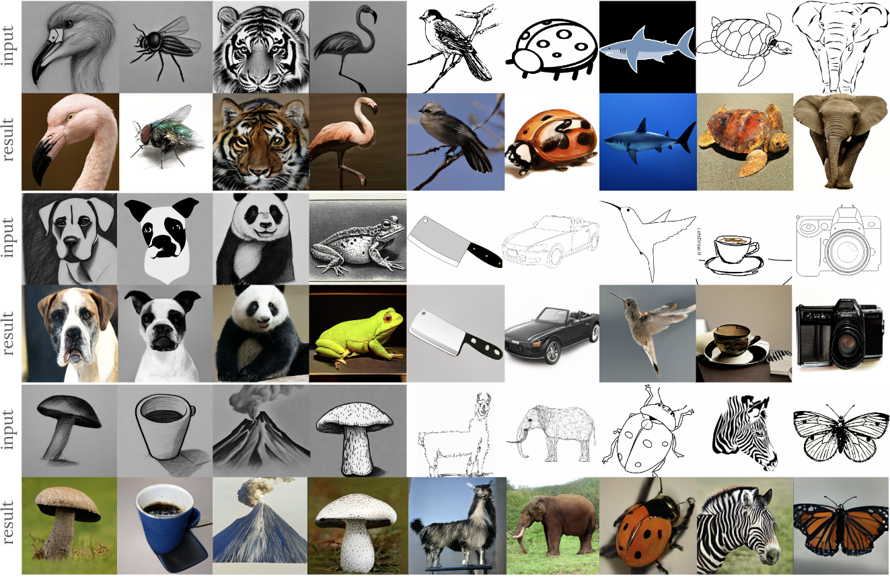

# MaskSketch: Unpaired Structure-guided Masked Image Generation [CVPR 2023]
Jax implementation of MaskSketch.


[[Paper](https://masksketch.github.io/paper.pdf)] [[Project Page](https://masksketch.github.io/)] [[Demo Colab](https://github.com/google-research/masksketch/blob/main/MaskSketch_demo.ipynb)]



## Summary
MaskSketch is a structure-conditional image generation model based on [MaskGIT](https://github.com/google-research/maskgit). Our method leverages the structure-preserving properties of the self-attention maps of MaskGIT to generate realistic images that follow the structure given an input image or sketch. 

## Install the dependencies
Please use the following commands to create an environment and install the dependencies:
    
    conda create --yes -n masksketch_env python=3.9
    conda activate masksketch_env
    bash install_dependencies.sh 


## Running pretrained models

Class conditional Image Genration models:

| Dataset  | Resolution | Model | Link | 
| ------------- | ------------- | ------------- | ------------- |
| ImageNet  | 256 x 256 | Tokenizer | [checkpoint](https://storage.googleapis.com/maskgit-public/checkpoints/tokenizer_imagenet256_checkpoint)| 
| ImageNet  | 256 x 256 | MaskGIT Transformer |[checkpoint](https://storage.googleapis.com/maskgit-public/checkpoints/maskgit_imagenet256_checkpoint)| 

You can run these models for sketch-conditional image **generation** in the [demo Colab](https://github.com/dbash/jax_masksketch/blob/main/MaskSketch_demo.ipynb).


## BibTeX

```
@inproceedings{bashkirova@masksketch,
    author    = {Bashkirova, Dina and Lezama, Jose and Sohn, Kihyuk and Saenko, Kate and Essa, Irfan },
    title     = {MaskSketch: Unpaired Structure-guided Masked Image Generation},
    howpublished = {Proceedings of the IEEE/CVF Conference on Computer Vision and Pattern Recognition},
    year      = {2023}
}
```

## Disclaimer

This is not an officially supported Google product.
